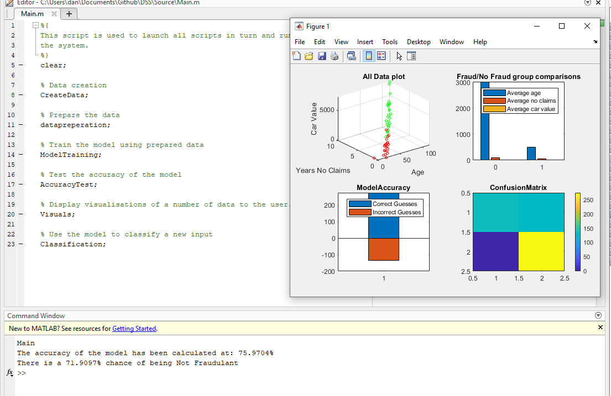

<!-- PROJECT LOGO -->
 

  

  <h3 align="center">Naive Bayes classification</h3>

  

    A small university project implementing a Naive Bayes model and training the model
    to predict the likelihood of fraudulant insurance claims based on multiple features.
     
  

<!-- ABOUT THE PROJECT -->
## About The Project

An implementation of the multi-feature Naive Bayes model and training the model
to predict the likelihood of fraudulant insurance claims based on multiple features.
As well as calculating accuracy using confusion matrix and outputting visuals.

### Built With

* [MATLAB]()

<!-- USAGE EXAMPLES -->
## Usage

To execute a full run of the system launch main script found under Source/
